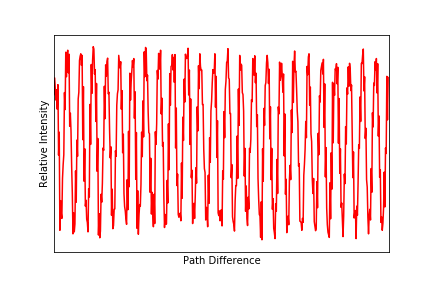
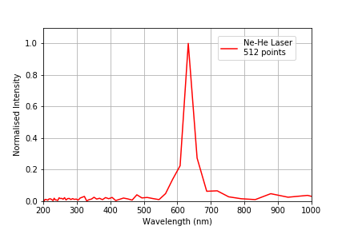
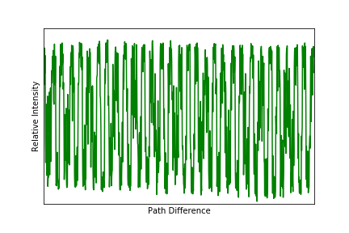
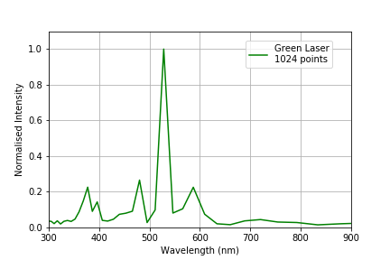
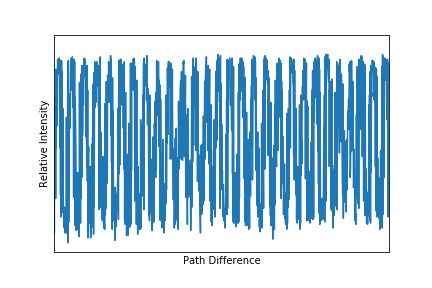
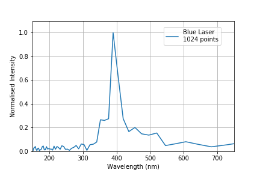
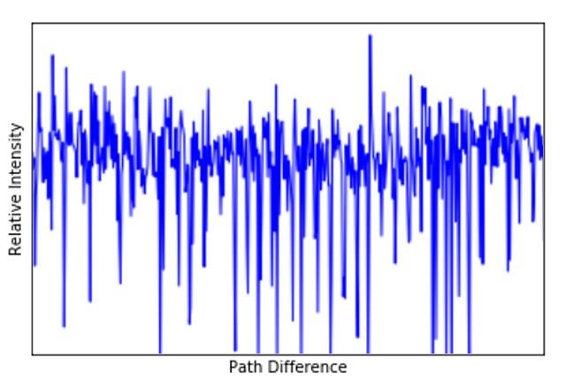

# Fourier Transforms
## Experimental Abstract
The interferograms of three single and one multi-frequency light sources are recorded via the phenomenon of interference. These functions of oscillating intensity with respect to path difference then undergo the onedimensional discrete Fourier Transform. To do so, an algorithm known as the Fast Fourier Transform is imported from the Python library package NumPy and is applied to the data. This computes the various frequency/frequencies and their relative intensities being combined to produce the source. Using the calculated path sampling interval, the wavelengths of such frequency values are analysed. For the neonhelium laser, an experimental wavelength value of 632.65 ± 0.83 nm was calculated. A less powerful green laser was then used to record a wavelength of 528.24 ± 0.69 nm. The final single frequency source analysed was a violet/blue laser. For it, a much lower wavelength of 390.01 ± 1.15 nm was determined. Spectrogram analysis was unable to be performed on the multi-frequency mercury lamp interferogram recorded, and as a result, no wavelengths contributing to the source could be evaluated.

## Data analysis

### Section 1: Ne-He Laser
In this section of the experiment the interferogram of an Ne-He Laser is measured and its Fourier transform is taken to produce a spectrogram. To this, the [velocity of the motor](https://github.com/ruairibrady/Fourier-Transforms/blob/master/outputs/red1.PNG) and the [sampling interval](https://github.com/ruairibrady/Fourier-Transforms/blob/master/outputs/red2.PNG) of the laser both required calculation. The plots shown below show the raw oscillating intensity of the laser and the wavelengths contributing to the source (at their relative intensities). Comparing the experimentally determined value of 632.65 ± 0.83 nm to the known value of a 633 nm, negligible percentage error exists which is accounted for in the final error. The source code and data file used to produce these can found in [Directory 1](https://github.com/ruairibrady/Fourier-Transforms/tree/master/1.%20Ne-He%20Laser/).

   

### Section 2: Green Laser
In this section of the experiment the interferogram of an Green Laser is measured and its Fourier transform is taken to produce a spectrogram. To this, the [velocity of the motor](https://github.com/ruairibrady/Fourier-Transforms/blob/master/outputs/green1.PNG) and the [sampling interval](https://github.com/ruairibrady/Fourier-Transforms/blob/master/outputs/green2.PNG) of the laser both required calculation. The plots shown below show the raw oscillating intensity of the laser and the wavelengths contributing to the source (at their relative intensities). Comparing the experimentally determined value of 528.24 ± 0.69 nm  to the known value of a 532 ± 10 nm, negligible percentage error exists which is accounted for in the final error. The source code and data file used to produce these can found in [Directory 1](https://github.com/ruairibrady/Fourier-Transforms/tree/master/2.%20Green%20Laser/).

   

### Section 3: Blue Laser
In this section of the experiment the interferogram of a Blue Laser is measured and its Fourier transform is taken to produce a spectrogram. To this, the [velocity of the motor](https://github.com/ruairibrady/Fourier-Transforms/blob/master/outputs/blue1.PNG) and the [sampling interval](https://github.com/ruairibrady/Fourier-Transforms/blob/master/outputs/blue2.PNG) of the laser both required calculation. The plots shown below show the raw oscillating intensity of the laser and the wavelengths contributing to the source (at their relative intensities). Comparing the experimentally determined value of 390.01 ± 1.15 nm  to the known value of a 405 nm, a percentage error of 3.5% exists. However due to the lack of an uncertainty in the theoretical wavelength of the laser it is unknown wherther this percentage error is accounted for in the final error. The source code and data file used to produce these can found in [Directory 1](https://github.com/ruairibrady/Fourier-Transforms/tree/master/3.%20Blue%20Laser/).

   

### Section 4: Mercury Lamp
In this section of the experiment the interferogram of a Mercury Lamp is measured and its Fourier transform. Unlike the other sources, an interference pattern could not be produced for the Mercury Lamp due to its multifrequency nature. However, a weak, varying intensity was detected by the oscilloscope. The interferogram shown below displays this weak oscillation surrounded by noise. The noise was a result of the lack of intensity produced by the beam as it passed through the Michelson interferometer. To mitigate such errors the beam was directed through a short focal length converging lens to enlarge the image. This increased the detectability of any oscillation in intensity via the photomultiplier tube but not enough to allow for the Fourier transform to be performed successfully. Shown in the plot below is the raw interferogram of the incoming signal.

 

